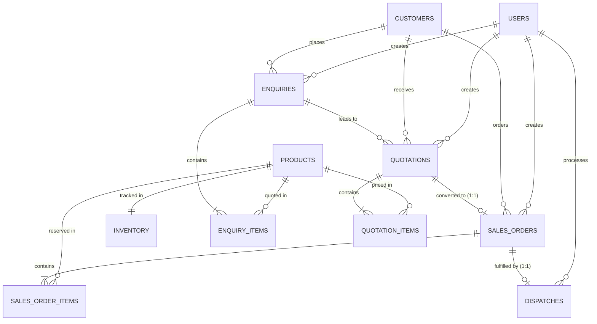

# Mini-ERP PERN — Full-Stack Technical Case Study

A production-ready, clean, maintainable, and explainable PERN (PostgreSQL, Express.js, React.js, Node.js) commercial workflow management application.

---

## 1. Project Overview & Business Workflow

Mini-ERP implements a strict, real-world commercial manufacturing and trading business workflow:

```
Customer Enquiry
       ↓
   Quotation
       ↓
Accepted Quotation
       ↓
  Sales Order
       ↓
Inventory Reservation  (Admin, Transactional Row-Locking)
       ↓
   Dispatch            (Admin, Transactional Stock Release)
```

### Core Integrity Principles
1. **Financial Precision**: Quotation line amounts, discounts, GST percentages, and grand totals are strictly calculated and validated on the Node.js backend. The frontend total is never trusted.
2. **Relational Consistency**: PostgreSQL foreign keys, unique constraints, and check constraints guarantee strict document traceability and prevent data anomalies.
3. **Transactional Inventory Protection**: Inventory reservations and dispatches are fully atomic. Row-level locks (`SELECT ... FOR UPDATE`) protect against overselling and race conditions under simultaneous concurrent orders.
4. **Backend RBAC**: Role-based access control (`ADMIN` vs `SALES`) is strictly enforced in Express middleware.

---

## 2. Technology Stack

- **Frontend**: React 18, Vite, Native `fetch` API, Responsive CSS (no heavy external UI framework bloat).
- **Backend**: Node.js 22, Express 4, `pg` (node-postgres with connection pooling), `bcryptjs`, `jsonwebtoken`.
- **Database**: PostgreSQL 17 (hosted on Supabase).
- **Testing**: Native Node.js test runner (`node:test`, `node:assert`).

---

## 3. Project Structure

```
mini-erp-pern/
├── backend/
│   ├── src/
│   │   ├── controllers/
│   │   │   ├── authController.js
│   │   │   ├── customerController.js
│   │   │   ├── enquiryController.js
│   │   │   ├── quotationController.js
│   │   │   ├── salesOrderController.js
│   │   │   ├── productController.js
│   │   │   └── inventoryController.js
│   │   ├── routes/
│   │   │   ├── authRoutes.js
│   │   │   ├── customerRoutes.js
│   │   │   ├── enquiryRoutes.js
│   │   │   ├── quotationRoutes.js
│   │   │   ├── salesOrderRoutes.js
│   │   │   ├── productRoutes.js
│   │   │   └── inventoryRoutes.js
│   │   ├── middleware/
│   │   │   ├── auth.js            # JWT verification
│   │   │   ├── rbac.js            # Role-based authorization
│   │   │   └── errorHandler.js    # Sanitized error responses
│   │   ├── db/
│   │   │   └── index.js           # PostgreSQL connection pool
│   │   └── utils/
│   │       ├── calculations.js    # Backend discount & GST formulas
│   │       ├── documentNumber.js  # Safe document numbering
│   │       └── inventoryHelper.js # Centralized stock availability
│   ├── database/
│   │   ├── schema.sql             # Relational DDL & constraints
│   │   ├── seed.sql               # Seed users, products & inventory
│   │   ├── migrate.js             # Migration script
│   │   └── seed.js                # Seed runner script
│   ├── tests/
│   │   └── app.test.js            # Automated test suite (6 tests)
│   ├── .env.example
│   ├── package.json
│   └── server.js
│
├── frontend/
│   ├── src/
│   │   ├── components/
│   │   │   └── Navbar.jsx         # Navigation & workflow progress
│   │   ├── pages/
│   │   │   ├── LoginPage.jsx      # Login with one-click demo credentials
│   │   │   ├── EnquiriesPage.jsx  # Multi-product enquiry builder
│   │   │   ├── QuotationsPage.jsx # Pricing, calculations & conversion
│   │   │   ├── SalesOrdersPage.jsx# Live stock indicators, reserve & dispatch
│   │   │   └── InventoryPage.jsx  # Stock availability & admin adjustment
│   │   ├── services/
│   │   │   └── api.js             # Lightweight native fetch client
│   │   ├── App.jsx
│   │   ├── main.jsx
│   │   └── index.css
│   ├── index.html
│   ├── vite.config.js
│   ├── .env.example
│   └── package.json
│
├── mini-erp.postman_collection.json # Complete Postman API collection
├── README.md
└── .gitignore
```

---

## 4. Entity-Relationship (ER) Diagram



### Relational Schema Summary
- **`inventory`**: `product_id` (FK, UNIQUE), `physical_quantity`, `reserved_quantity`. Check constraint ensures `reserved_quantity <= physical_quantity`.
  - Available stock formula: `available_quantity = physical_quantity - reserved_quantity`.
- **`sales_orders.quotation_id`**: Marked `UNIQUE` in PostgreSQL, mathematically enforcing that a quotation can generate **at most one** Sales Order.

---

## 5. Demo Login Credentials

| Role | Email | Password | Allowed Operations |
|---|---|---|---|
| **ADMIN** | `admin@erp.com` | `Admin@123` | View all, Manage stock, Confirm order (Reserve stock), Dispatch order |
| **SALES** | `sales@erp.com` | `Sales@123` | Create customers, Create enquiries, Create quotations, Convert accepted quotations to sales orders, View stock |

*(Quick autofill buttons are provided on the login page for instantaneous testing).*

---

## 6. Setup & Execution Instructions

### Prerequisites
- Node.js >= 18 (Node 22 recommended)
- PostgreSQL database (Supabase instance is already preconfigured in `.env`)

### Backend Setup
```bash
cd backend
npm install
npm run migrate   # Applies schema.sql
npm run seed      # Applies seed.sql
npm run dev       # Starts Express server on http://localhost:5000
```

### Frontend Setup
```bash
cd frontend
npm install
npm run dev       # Starts Vite dev server on http://localhost:3000
```

Open `http://localhost:3000` in your browser.

---

## 7. Automated Tests

The test suite runs using Node.js's built-in test runner without third-party dependencies:

```bash
cd backend
npm test
```

### Tests Covered
1. **Quotation Financial Calculation**: Verifies backend calculation of base amount, discount %, GST %, line amounts, and grand total.
2. **Quotation Conversion Validation**: Confirms `DRAFT` or `REJECTED` quotations cannot create a Sales Order.
3. **Duplicate Prevention**: Verifies that converting the same quotation twice fails safely with HTTP 409 Conflict.
4. **Stock Protection**: Confirms order confirmation cannot reserve more stock than available and rolls back completely without partial state changes.
5. **Backend RBAC Security**: Confirms `SALES` role users receive HTTP 403 Forbidden when attempting restricted actions (inventory edits, order confirmations, dispatches).
6. **Concurrency Race-Condition Safety**: Fires simultaneous confirmation requests for competing stock (available = 100, Order A = 80, Order B = 50); verifies exactly one succeeds, one fails safely, and stock is never oversold.

---

## 8. Financial Calculations & Business Logic

All financial computations are performed on the backend in `backend/src/utils/calculations.js`:

1. **Base Amount**:
   $$\text{base\_amount} = \text{round}(\text{quantity} \times \text{unit\_price}, 2)$$
2. **Discount Amount**:
   $$\text{discount\_amount} = \text{round}(\text{base\_amount} \times \frac{\text{discount\_pct}}{100}, 2)$$
3. **Taxable Amount**:
   $$\text{taxable\_amount} = \text{round}(\text{base\_amount} - \text{discount\_amount}, 2)$$
4. **GST Amount**:
   $$\text{gst\_amount} = \text{round}(\text{taxable\_amount} \times \frac{\text{gst\_pct}}{100}, 2)$$
5. **Line Total**:
   $$\text{line\_amount} = \text{round}(\text{taxable\_amount} + \text{gst\_amount}, 2)$$
6. **Grand Total**: Sum of all line totals.

---

## 9. Transactional Concurrency & Row Locking

### Sales Order Confirmation (Reservation)
Implemented in `backend/src/controllers/salesOrderController.js`:
```sql
BEGIN;
-- 1. Lock Sales Order row
SELECT * FROM sales_orders WHERE id = $1 FOR UPDATE;

-- 2. Lock inventory rows in sorted product_id order (prevents deadlocks)
SELECT * FROM inventory WHERE product_id = $prodId FOR UPDATE;

-- 3. Check available quantity from the locked state
-- available = physical_quantity - reserved_quantity
-- IF available < required: ROLLBACK; return 400 Insufficient Inventory

-- 4. Increment reserved_quantity (physical_quantity remains unchanged)
UPDATE inventory SET reserved_quantity = reserved_quantity + $qty, updated_at = NOW() WHERE product_id = $prodId;

-- 5. Mark Sales Order as CONFIRMED
UPDATE sales_orders SET status = 'CONFIRMED' WHERE id = $1;
COMMIT;
```

### Order Dispatch
```sql
BEGIN;
SELECT * FROM sales_orders WHERE id = $1 FOR UPDATE;
-- Verify status is CONFIRMED
-- Lock inventory rows FOR UPDATE
-- Decrement both physical_quantity and reserved_quantity:
UPDATE inventory 
SET physical_quantity = physical_quantity - $qty,
    reserved_quantity = reserved_quantity - $qty,
    updated_at = NOW() 
WHERE product_id = $prodId;

-- Insert into dispatches table
INSERT INTO dispatches (dispatch_number, sales_order_id, vehicle_number, driver_name, created_by) ...
UPDATE sales_orders SET status = 'DISPATCHED' WHERE id = $1;
COMMIT;
```

---

## 10. Live-Change Preparation Guide

The codebase is structured modularly so any interviewer requirements can be added in minutes:

### 1. Adding "Damaged Stock"
- **Database (`schema.sql`)**: Add column `damaged_quantity INT NOT NULL DEFAULT 0 CHECK (damaged_quantity >= 0)` to table `inventory`.
- **Calculation (`src/utils/inventoryHelper.js`)**: Update helper:
  ```js
  function calculateAvailableQuantity(physical, reserved, damaged = 0) {
    return Number(physical) - Number(reserved) - Number(damaged);
  }
  ```
- All stock checks in `confirmSalesOrder` automatically inherit the new formula.

### 2. Adding "Order Cancellation" & Stock Release
- When cancelling a `CONFIRMED` order:
  1. Open transaction: `SELECT ... FOR UPDATE` on order and inventory.
  2. Decrement `reserved_quantity = reserved_quantity - item.quantity`.
  3. Set order status to `CANCELLED`.
  4. `COMMIT`.

---

## 11. Assumptions & Limitations
- Single default currency: Indian Rupee (₹).
- Dispatches are performed per entire confirmed order (partial dispatches can be modeled by adding a `dispatch_items` table if required).
- Product pricing uses standard 2-decimal rounded precision appropriate for industrial accounting.
